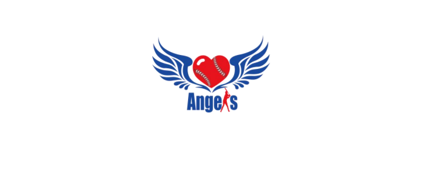
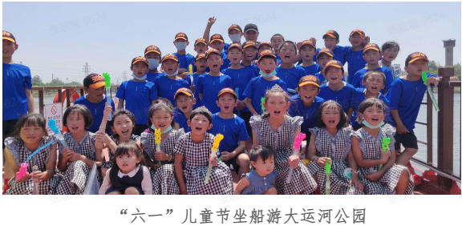
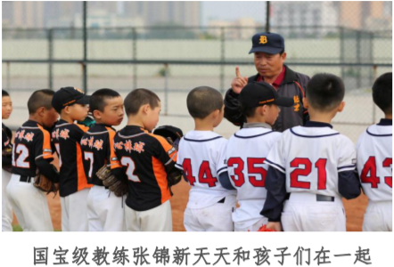
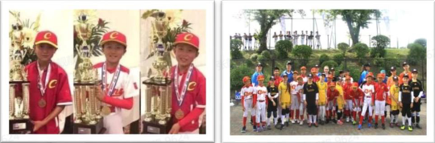
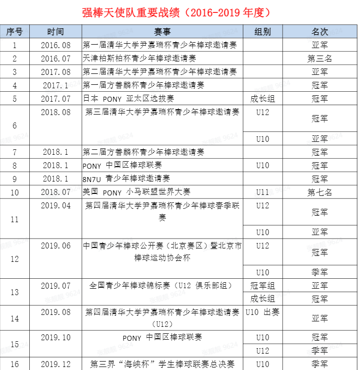

### 1.项目起源  
随着棒球产业的不断发展，棒球人才的需求量越来越多，棒球人才的未来机遇也将前所未有。  
强棒基地由前国家棒球队队长孙岭峰与爱心人士联合筹资建设，中国队长的梦想--用棒球给困境中的孩子一个选择未来的机会！  

### 2.项目意义  
> 授人以鱼不如授人以渔  
> 
    基地主要资助对象为全国范围内7-10岁困境儿童，通过专业的棒球技能获得职业发展方向和未来的就业机会。  
    在解决基本问题的同时，塑造健全、独立品格，帮助他们实现人生目标。  
    
### 3.发展历程  
五年搬了四次家，至2020年11月，项目共资助困境儿童80名，其中女孩26名。  

### 4.专业训练  
“爱心棒球基地”实现全封闭管理模式，孩子们会在基地接受专业的棒球职业训练。  
中国棒球“国宝级”老教练张锦新担任训练总顾问，主教练孙岭峰针对孩子的年龄及特征制定训练方案。  

  

### 5.训练成果  
“强棒天使队”是中国第一支代表亚太地区征战世界的少年棒球队，在国内外多项棒球赛事中披金斩银！  

  
  

